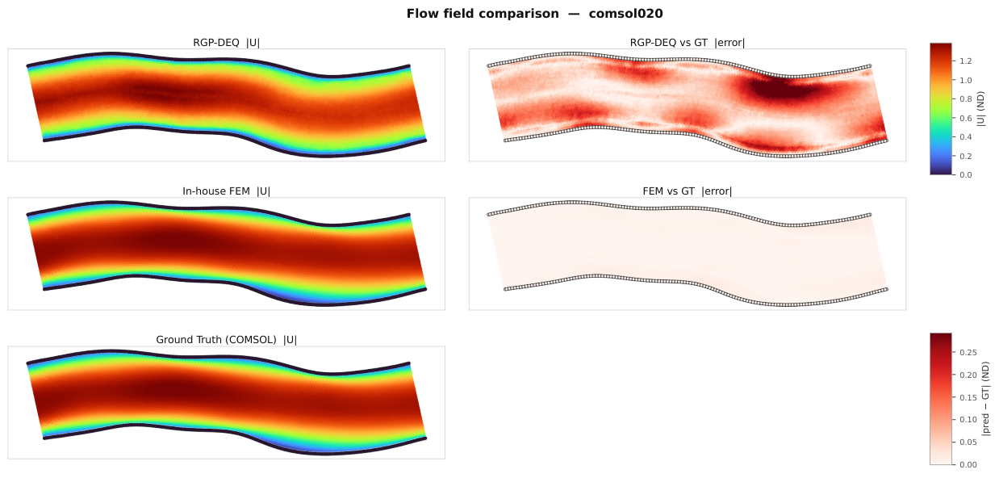

# Local FEM Solver

**Predicting where blood clots form inside a blood vessel — in seconds, on a laptop.**

[](https://github.com/sylpagnier/2d-vessel-thrombosis-surrogate/releases/latest)
[](LICENSE)

Simulating thrombosis (clot formation) normally means running commercial finite-element
software for hours per vessel. This project replaces the slow part with a pair of fast
local solvers: an in-house non-Newtonian **flow solver**, and a graph neural network that
**grows the clot** on top of the flow field.

---

## Try it without installing anything

Download the latest **[Predict app release](https://github.com/sylpagnier/2d-vessel-thrombosis-surrogate/releases/latest)**,
unzip it, and double-click `run.bat`. Everything is inside the zip — a bundled Python, a
CPU-only build of PyTorch, the trained model weights, and a demo vessel. No GPU, no install,
no Python knowledge required. A browser tab opens when it's ready.


You draw or upload a vessel shape; the app returns how much of the wall is covered by clot,
how much of the channel is blocked, and how that develops over time.

---

## What problem this solves

Blood is **shear-thinning** — it gets runnier where it moves fast, thicker where it stalls.
Clots form preferentially in the slow, recirculating corners that geometry creates. So
predicting a clot means first getting the flow field right, then evolving chemistry and
deposition on top of it.

The reference answer comes from COMSOL Multiphysics, which is accurate but slow and
commercially licensed. This repository asks how much of that you can reproduce locally.

### The flow result

The in-house FEM solver reproduces the COMSOL velocity field to within a fraction of a
percent, while the learned graph surrogate (RGP-DEQ) is roughly 30× further off:



| Vessel | In-house FEM (MAE, ND) | RGP-DEQ surrogate (MAE, ND) |
|--------|-----------------------:|----------------------------:|
| comsol020 | **0.0028** | 0.0883 |
| comsol005 | **0.0041** | 0.0912 |

That gap is why the shipped pipeline solves the flow directly rather than learning it. The
learned flow arm is kept in the repository as a research and ablation baseline, not as the
default.

### The clot result

The clot model (`clot_ml_0`) is scored under geometry-stratified 5-fold **strict nested
out-of-fold** cross-validation, with every readout threshold selected outside the held-out
fold, on a pool of 23 clot-carrying and 8 clot-free vessels:

| Region | Final-state score | Mean over time |
|--------|------------------:|---------------:|
| Wall clot | 0.920 | 0.869 |
| Off-wall clot | 0.708 | 0.579 |

**An important caveat, stated plainly:** those numbers were obtained using the *ground-truth*
t=0 flow field, not predicted flow. They are a research baseline. A predicted-flow result is
required before this can be quoted as cold-deploy performance, and the released artifact is
explicitly flagged `cold_deploy: blocked` for that reason.

---

## How it works

```text
vessel geometry (drawn, generated, or meshed)
        |
        v
  local FEM solver          non-Newtonian Carreau flow at t=0
        |                   (velocity, pressure, effective viscosity)
        v
  clot_ml_0                 temporal graph neural network:
        |                   wall deposition + off-wall growth + wound response
        v
  clot map over time        wall coverage, lumen occlusion, clot span
```

The two stages are independent: the clot model consumes a flow field, and does not care
whether it came from the local FEM solver, from COMSOL, or from the learned surrogate. That
is what makes the flow-source comparison above a controlled experiment.

| Component | Name in the code | Role |
|-----------|------------------|------|
| Product pipeline | `local-fem-solver` | FEM-seeded clot prediction and parametric sweeps |
| Flow (shipped) | `local_fem_solver` | Carreau FEM at t=0 |
| Clot | `clot_ml_0` | Temporal GNN, wall + off-wall + wound |
| Flow (research) | `rgp-deq-kine` | Physics-informed graph DEQ, ablation baseline |

Naming and legacy aliases: [`docs/MODEL_NOMENCLATURE.md`](docs/MODEL_NOMENCLATURE.md).

---

## About the vessel data

Every vessel in this project is **synthetic**. There is no patient data of any kind here.

Two cohorts appear throughout the code and docs:

- **COMSOL anchors** (`comsol001` … `comsol048`) — synthetic vessels that were solved in
  COMSOL Multiphysics to produce ground-truth flow and clot trajectories. These are the
  reference cases everything is scored against.
- **Synthetic / parametric vessels** — generated in-house by sweeping geometry parameters
  (stenosis strength, bend, wound position, and so on). See
  [`configs/research_sweeps/`](configs/research_sweeps).

The meshes, graphs, CFD extracts, and trained weights are **not** in this repository — they
are large binaries. See [`docs/PUBLISHING.md`](docs/PUBLISHING.md) for what is tracked and
what is generated locally.

---

## Development

Python 3.11–3.13. A CUDA GPU is recommended for training but not for inference.

```bash
pip install -r requirements.txt
pytest src/tests/
```

Common entry points:

```bash
# Parametric geometry sweeps (FEM flow + clot_ml_0)
powershell -NoProfile -ExecutionPolicy Bypass -File ./scripts/go_research_sweep.ps1

# Promote and evaluate the clot model
python scripts/promote_clot_ml_0.py
python scripts/eval_clot_ml_0.py --cohort

# Diagnostic probes (see `list` for the full set)
python -m src.tools.diagnostics list

# Train the research flow arm
python -m src.bin.main train rgp-deq-kine
```

### Repository layout

```text
src/                   Library: architecture, physics, training, evaluation, tools, tests
scripts/               Supported launchers and evaluation entry points
configs/               Parametric sweep definitions
docs/                  Design and validation docs
data/reference/        Small tracked JSON manifests of canonical runs
outputs/               LOCAL — checkpoints, logs, figures (gitignored)
comsol_models/         LOCAL — COMSOL sources (gitignored)
```

---

## Documentation

| Doc | Contents |
|-----|----------|
| [`docs/PROJECT_CONTEXT.md`](docs/PROJECT_CONTEXT.md) | Goals, stages, source map, entry points |
| [`docs/MODEL_NOMENCLATURE.md`](docs/MODEL_NOMENCLATURE.md) | Canonical model IDs and naming |
| [`docs/COMSOL_PHYSICS_VALIDATION.md`](docs/COMSOL_PHYSICS_VALIDATION.md) | Flow and physics parity against COMSOL |
| [`docs/SEALED_SPLIT.md`](docs/SEALED_SPLIT.md) | Which vessels are held out, and why |
| [`docs/RESEARCH_SWEEPS.md`](docs/RESEARCH_SWEEPS.md) | Parametric geometry sweeps |
| [`docs/RELATED_WORK.md`](docs/RELATED_WORK.md) | Where this sits in the literature |
| [`docs/CUSTOMER_INSTALLER.md`](docs/CUSTOMER_INSTALLER.md) | Building the self-contained Predict app |
| [`docs/PUBLISHING.md`](docs/PUBLISHING.md) | What is tracked vs. generated locally |
| [`docs/README.md`](docs/README.md) | Full documentation index |

## Contributing

See [CONTRIBUTING.md](CONTRIBUTING.md). Issues and questions are welcome.

## License

[MIT](LICENSE).
