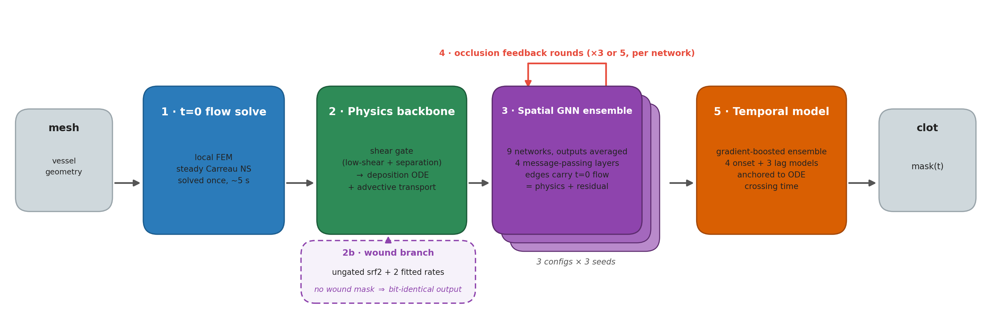
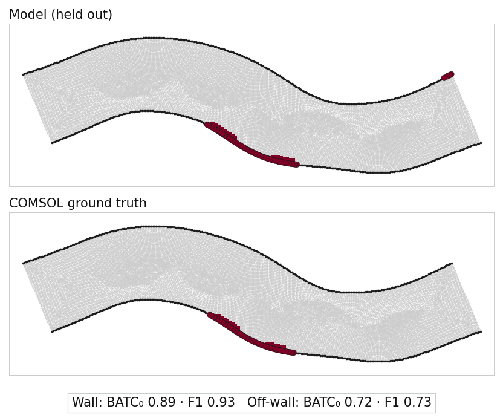
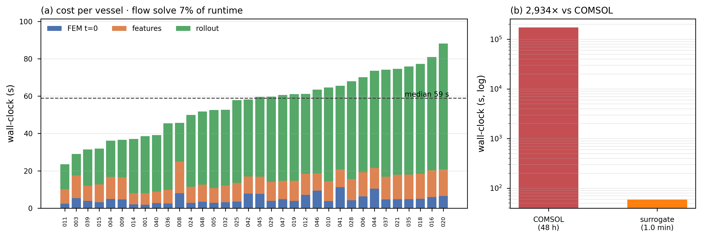
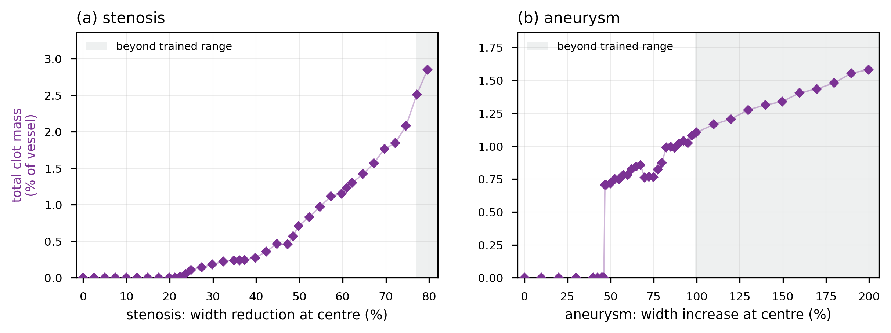

# 2D Thrombosis Surrogate

**Predict where a blood clot (thrombus) forms and how it grows in a 2D vessel in about a minute instead of two days.**

[](https://github.com/sylpagnier/2d-vessel-thrombosis-surrogate/releases/latest)
[](LICENSE)

A full thrombosis simulation in COMSOL takes about **48 hours** per vessel. This project gives
you a good approximation of the same clot field over time, for healthy or injured vessels, in a **median of 59 seconds**
on a laptop GPU: roughly **2,900× faster**. It solves the blood flow once with a small in-house
finite-element solver, then a physics informed graph neural network grows the clot on top of that flow.

---

## Try it

Download the zip for your computer from the **[latest release](https://github.com/sylpagnier/2d-vessel-thrombosis-surrogate/releases/latest)**.
No GPU is needed on any of them. The release notes list each zip's SHA-256, so you can check your download.

| Your computer | Download | Then |
|---------------|----------|------|
| **Windows** | `…-win64-….zip` | Unzip somewhere with a short path (e.g. `C:\ThrombosisSurrogate\`) and double-click `run.bat`. Nothing else to install. |
| **Mac** (Apple Silicon, M1 or later) | `…-macos-linux-….zip` | Install [Python 3.13](https://www.python.org/downloads/), unzip, and double-click `run.command`. If macOS blocks it, right-click it and choose **Open**. The first launch downloads about 1 GB and takes a few minutes. |
| **Linux** (x86-64) | `…-macos-linux-….zip` | With Python 3.12+ installed, unzip and run `./run.sh`. It tells you if any system libraries are missing (on Ubuntu: `sudo apt install python3-venv libglu1-mesa libopengl0 libxft2 libgomp1`). |

Intel Macs are not supported, because PyTorch no longer builds for them.


Draw a vessel or load one, and the app shows how much of the wall clots, how much of the
channel gets blocked, and how both change over time.

---

## How it works



1. **Solve the flow once.** A non-Newtonian (Carreau) finite-element solve gives the velocity
   field at the start, in about 5 seconds.
2. **Apply the physics.** A shear-based deposition law marks where clot can start. On an
   injured wall, a separate wound law takes over.
3. **Learn the rest.** An ensemble of graph neural networks refines where clot actually forms,
   and a temporal ensemble refines when each region clots.

---

## Results

Every vessel here is a **synthetic** geometry with a COMSOL simulation as ground truth; there is
no patient data. Scores use BATC₀, the strict setting of our clot-overlap score
([`severity_metric.py`](src/clot_ml/severity_metric.py)): 0 to 1, higher is better, reported
separately for the vessel **wall** and the **off-wall** interior.

**Held-out accuracy** (5-fold cross-validation over 27 vessels, using the app's own flow solve):

| Vessel type | Vessels | Wall | Off-wall |
|-------------|--------:|-----:|---------:|
| General: often curved, may have a mild narrowing or bulge | 20 | 0.91 | 0.64 |
| Built with a stenosis (narrowing) | 5 | 0.86 | 0.79 |
| Built with an aneurysm (bulge) | 2 | 0.97 | 0.92 |

The general vessels are not simple tubes: bends and mild pathology make many of them hard
cases, and one is narrower than any of the built stenoses.

Two of the stenosis vessels are perfectly mirror-symmetric, and on those the blood flow has two
equally valid solutions that are mirror images of each other. COMSOL settled on one, and our flow
solve settles on the other, so the model's clot comes out correctly placed but reflected. Those two
vessels are scored against the mirrored ground truth. The choice is made from the flow alone, never
from the clot score ([`mirror_branch.py`](src/clot_ml/mirror_branch.py),
[`configs/mirror_branch.json`](configs/mirror_branch.json)).



*One held-out vessel (`comsol021`), picked because its scores sit at the cohort median rather
than the best case. F1 here is node-exact: a prediction one node away counts as a miss, which
is why BATC₀ allows a small spatial tolerance.*

**Sealed test set:** 4 vessels locked away from the start and scored exactly once, after every
design choice was frozen: **0.96** wall, **0.62** off-wall.

**Injured vessels** (first pass, 6 vessels never seen in training): the wound branch lifts the
wound-region score from **0.09** with the network alone to **0.88**.

Five stenosis and two aneurysm vessels, and six injured vessels, are small samples. All results
cover up to **8.3 hours** (30,000 s) of simulated time, the longest COMSOL runs we have; longer
horizons are untested, so the app stops there. How every number here is checked, and the
retractions behind some of them, are in
[`docs/publication/EVIDENCE.md`](docs/publication/EVIDENCE.md). The claim document itself is held
back until the paper is out.

### Why solve the flow instead of learning it?

We also built a learned flow model (RGP-DEQ). Its velocity error is close to the solver's, but
it misplaces the low-shear zones where clots start, and that costs accuracy downstream. The flow
solve is also only **8%** of total runtime, so even a perfect, instant learned model could save
at most that.

| Flow source | Velocity error | Overlap with true clot-trigger zones |
|-------------|---------------:|-------------------------------------:|
| Finite-element solve (shipped) | 0.6% | **92%** |
| Learned model (RGP-DEQ) | 1.7% | 76% |



---

## What it's for

At two days per COMSOL run, most questions get answered with a handful of vessels. At about a
minute per vessel you can ask many more:

- **Geometry sweeps.** Vary one feature of a vessel (stenosis severity, aneurysm size, bend,
  length, wall roughness) and see where the clot response changes. For example, the 80-geometry
  sweep below took about 39 minutes here and would take about 160 days in COMSOL. Sweep definitions are in
  [`configs/research_sweeps/`](configs/research_sweeps/).

  

  *Strength is how much narrower (stenosis) or wider (aneurysm) the vessel is at the centre of the
  pathology. A stenosis starts to clot at about a fifth narrowing, and its clot mass keeps
  accelerating up to the most severe stenosis in training. An aneurysm collects none until it is
  about 46% wider, then a lot at once, and grows more slowly after that. Shaded points are more severe than anything the model was
  trained on. These are the model's own predictions with no COMSOL run at any sweep point, so read
  them as what the tool suggests, not as validated thresholds.*
- **Screening before full simulation.** Run many candidate geometries quickly, then spend COMSOL
  time only on the ones that matter.
- **Device and surgical planning research.** Compare "before and after" shapes of the same
  vessel, such as a narrowing that has been widened or a bulge that has been excluded.
- **Teaching.** Draw a vessel in the app and see how shape and injury change where clots form.

**Not a clinical tool.** The model is trained and validated only on synthetic 2D vessels, never
on patient data, and it has no regulatory clearance. Clinical uses are a research direction,
not something to base patient decisions on. Predictions at sweep points with no COMSOL run are
the model's own estimates, and their reliability rests on the held-out results above.

---

## For developers

Python 3.11–3.13. A CUDA GPU helps for training; inference runs on CPU.

```bash
pip install -r requirements.txt
pip install -e .
pytest src/tests/
```

Meshes, simulation data and trained weights are large and are **not** in this repository; tests
that need them skip. [`docs/PUBLISHING.md`](docs/PUBLISHING.md) lists what is tracked.

| Where | What |
|-------|------|
| `src/` | Flow solver, clot model, physics, training, evaluation, app, tests |
| [`scripts/`](scripts/README.md) | Training, evaluation and release launchers |
| `configs/research_sweeps/` | Parametric geometry sweeps |
| [`docs/`](docs/README.md) | Design, validation and naming docs |
| [`docs/publication/`](docs/publication/) | The paper's claims, evidence and figures |

## Contributing and license

Issues and questions are welcome; see [CONTRIBUTING.md](CONTRIBUTING.md). Released under the
[MIT license](LICENSE).
