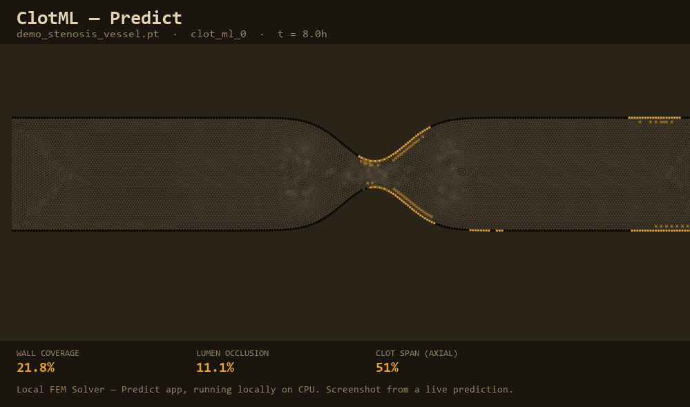

# Local FEM Solver

[](https://github.com/sylpagnier/2d-vessel-thrombosis-surrogate/releases/latest)

Deployable **thrombosis surrogate** for parametric vessel studies: in-house non-Newtonian **FEM at t=0** + unified mesh-based **deploy-clot** (`clot_ml_0`) rollout (wounded and non-wounded vessels).

**local-fem-solver** is mesh-agnostic SciML for vascular flow and clot formation. The publishable deploy path is geometry → local Carreau FEM (t=0) → **deploy-clot** (`clot_ml_0`). Learned flow (`rgp-deq-kine` / RGP-DEQ) remains in-repo as a research and ablation arm, not the default product stack.

| Layer | Canonical name | Role |
|-------|----------------|------|
| Product | **Local FEM Solver** (`local-fem-solver`) | FEM-seeded deploy + parametric sweeps |
| Deploy clot | **deploy-clot** (`clot_ml_0`) | Unified wall + wound thrombosis surrogate |
| Flow (deploy) | **local FEM solver** | Carreau t=0 solve into `u0_pred` / `v0_pred` |
| Flow (research) | **RGP-DEQ** (`rgp-deq-kine`) | Physics-informed graph DEQ ablation baseline |

Terminology and legacy aliases: [`docs/MODEL_NOMENCLATURE.md`](docs/MODEL_NOMENCLATURE.md).

---

## Architecture

### Deploy path (default)

```text
geometry
  -> local_fem_solver (t=0 Carreau FEM)
  -> clot_ml_0 (temporal GNN + wound complement + optional chemistry replace+depth)
```

Research sweeps (`configs/research_sweeps/`) use **FEM t=0 + deploy-clot** by default. See [`docs/RESEARCH_SWEEPS.md`](docs/RESEARCH_SWEEPS.md).

### rgp-deq-kine (research / ablation)

Deep-equilibrium graph model for steady non-Newtonian flow `[u, v, p, mu_eff]` on vessel meshes. Trained with mixed COMSOL anchors and PDE residuals. Documented as a flow-source ablation arm in [`docs/PUBLICATION_NOTES.md`](docs/PUBLICATION_NOTES.md) — not the default deploy flow backend.

```powershell
python -m src.bin.main train rgp-deq-kine
```

---

## Try it now (no install)

Download the latest **[Predict app release](https://github.com/sylpagnier/2d-vessel-thrombosis-surrogate/releases/latest)**, unzip, and double-click `run.bat`. It's a self-contained Windows bundle -- embedded Python, CPU-only PyTorch, the trained `clot_ml_0` checkpoints, and a seeded demo vessel are all inside, so there's nothing else to install and no GPU is required. A browser tab opens automatically once it's ready.

This is the recommended path for anyone who just wants to run predictions, not modify the code -- a plain `git clone` of this repo does **not** include the checkpoints or demo geometry (see [`docs/PUBLISHING.md`](docs/PUBLISHING.md)).



---

## Quick start (development)

### Install

Python 3.9+, CUDA recommended for training.

```powershell
pip install -r requirements.txt
```

Bulk meshes, graphs, and COMSOL `.mph` files are **not** in this repository. Place them under `data/` and `comsol_models/` on your machine ([`docs/PUBLISHING.md`](docs/PUBLISHING.md)).

### Demo apps

```powershell
# Vessel simulation UI (parametric geometry + clot timeline)
powershell -NoProfile -ExecutionPolicy Bypass -File .\scripts\go_customer_predict.ps1

# Parametric flow GUI (RGP-DEQ research stack)
python -m src.bin.main inspect flow -- --rheology carreau
```

### Deploy clot

```powershell
python scripts/promote_clot_ml_0.py
python scripts/eval_clot_ml_0.py --cohort
```

### Research sweeps

```powershell
powershell -NoProfile -ExecutionPolicy Bypass -File .\scripts\go_research_sweep.ps1
```

### Tests

```powershell
pytest src/tests/
```

---

## Repository layout

```text
src/                   Library: architecture, physics, training, tools, tests
scripts/               Supported launchers (+ scripts/archive/ for retired ladders)
docs/                  Active design docs (+ docs/archive/, docs/assets/)
data/reference/        Small JSON manifests (tracked)
customer_geometries/   Inbox README only (uploads stay local)
outputs/               LOCAL -- checkpoints, logs, figures (gitignored)
comsol_models/         LOCAL -- COMSOL sources (gitignored)
```

---

## Documentation

| Doc | Contents |
|-----|----------|
| [`docs/PROJECT_CONTEXT.md`](docs/PROJECT_CONTEXT.md) | Goals, stages, source map, entry points |
| [`docs/MODEL_NOMENCLATURE.md`](docs/MODEL_NOMENCLATURE.md) | Canonical IDs and SciML naming |
| [`docs/PUBLICATION_NOTES.md`](docs/PUBLICATION_NOTES.md) | Paper framing, flow ablation, deploy stack |
| [`docs/RESEARCH_SWEEPS.md`](docs/RESEARCH_SWEEPS.md) | Parametric geometry sweeps (FEM + clot_ml_0) |
| [`docs/WOUND_PROGRESS.md`](docs/WOUND_PROGRESS.md) | Wound complement and clot_ml_0 composition |
| [`docs/PUBLISHING.md`](docs/PUBLISHING.md) | Public vs local artifact policy |
| [`docs/README.md`](docs/README.md) | Full documentation index |

Contributor / agent shortcuts: [`AGENTS.md`](AGENTS.md).

## License

[MIT](LICENSE).
